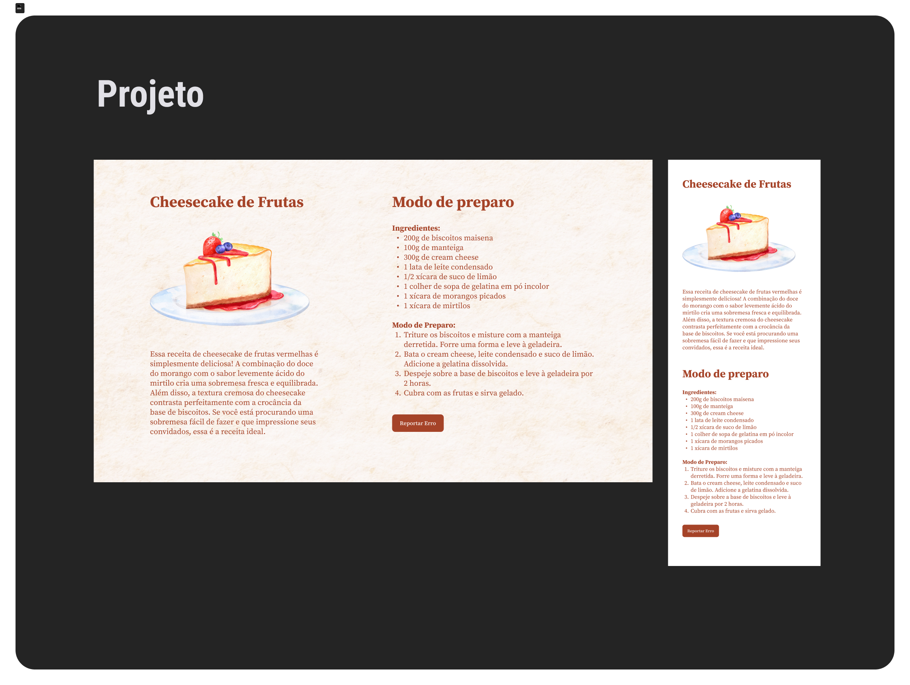

  

  

## 🖥️ Projeto
Esse é um projeto web de onde feito uma pagina para publicação de receitas nessa espcifica de um cheesecake, aplicando a responsividade, ou seja, ajustando o conteúdo para aparelhos mobile e desktop.

## 🚀 Tecnologias
Esse projeto foi desenvolvido durante o curos de Explore da Rocketsat com as seguintes tecnologias:

- HTML
- CSS
- GIT E GITHUB
- FIGMA

## 🏷️layout
Você pode visualizar o layout do projeto através 
[desse link](https://www.figma.com/file/3O5Bed6s5s6XitDYtxZPgq/Cheesecake-%E2%80%A2-Projeto-Explorer-(Community)?node-id=0%3A1&mode=dev).
É necessario ter uma conta no [Figma](https://www.figma.com).